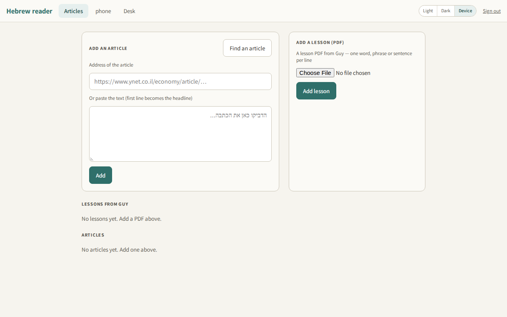
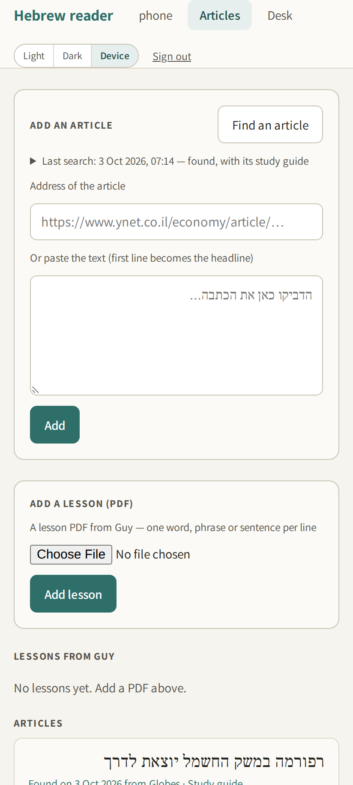
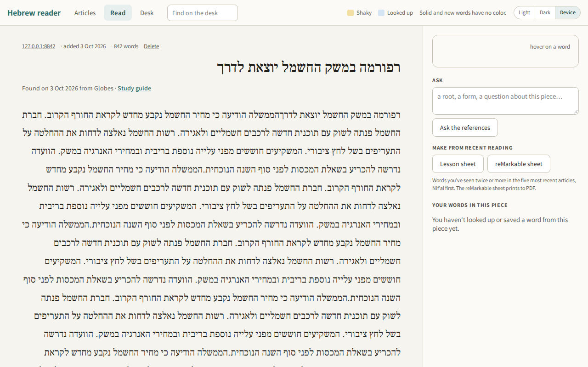
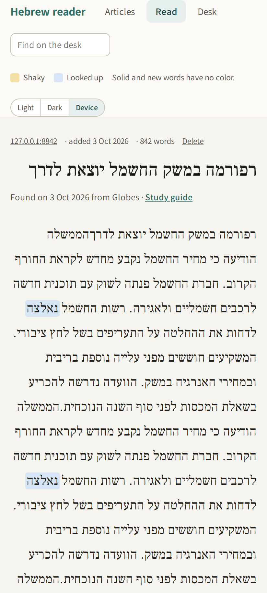
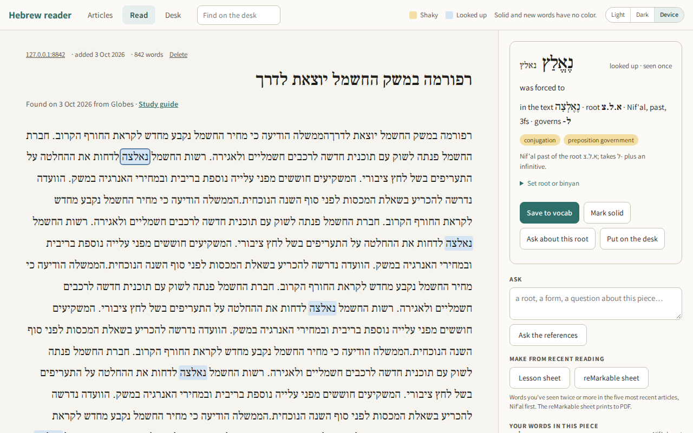
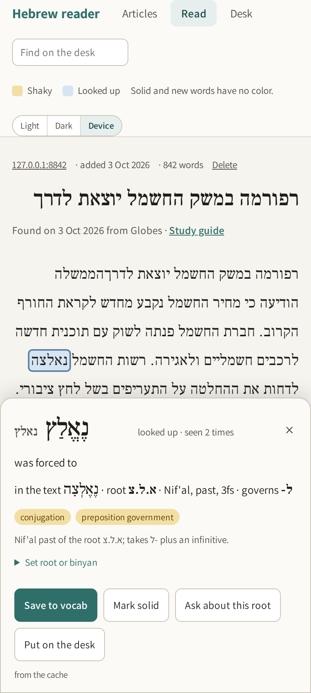
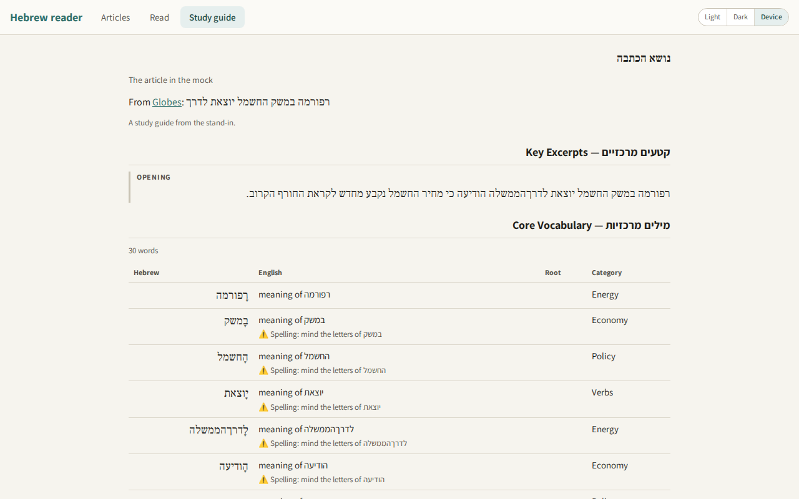
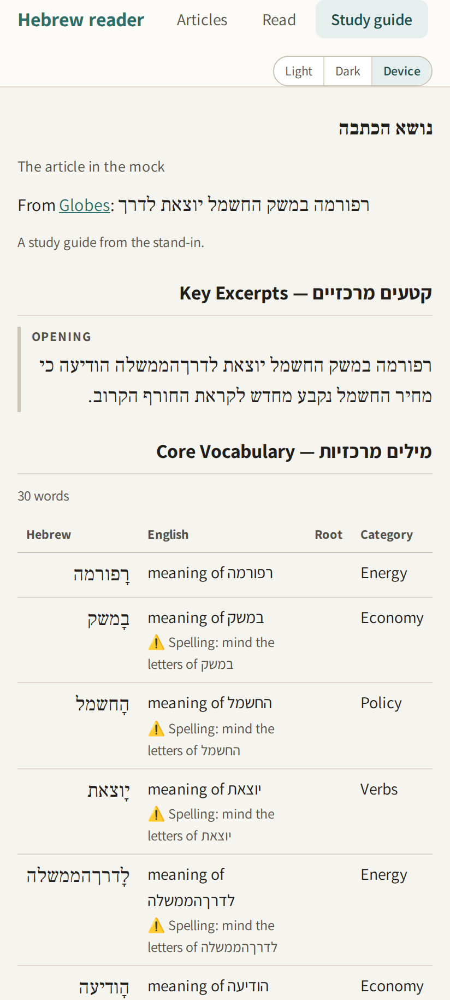
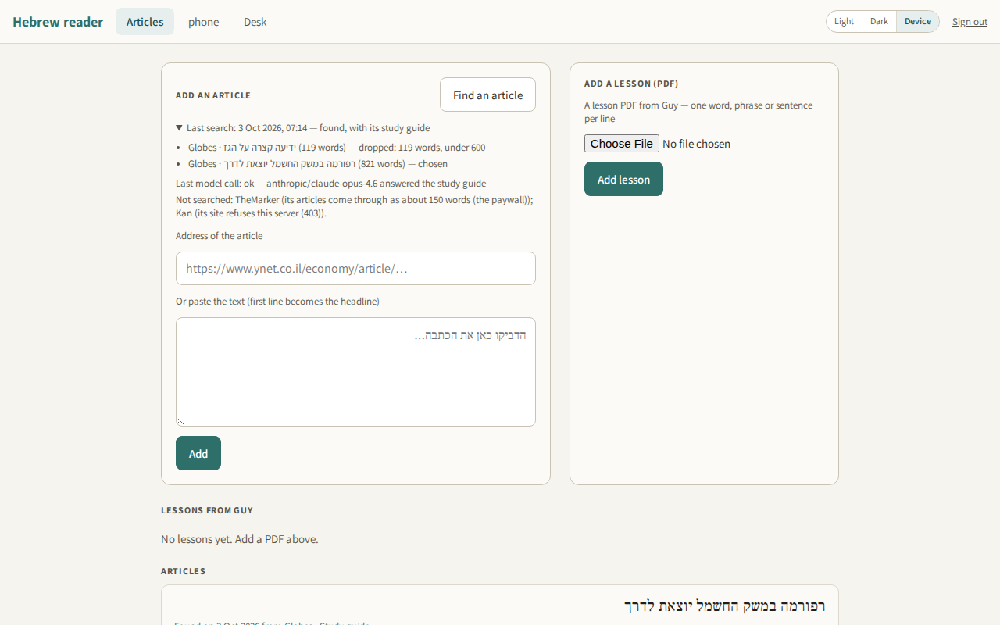
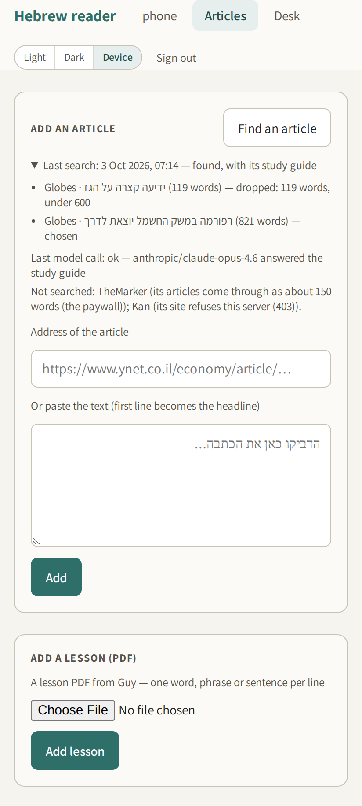

# FIELD REPORT — hebrew-hunt-build — 3 Oct 2026

The reader can now find an article on its own. On the Articles screen there
is a **Find an article** button. One tap looks through recent Globes,
Calcalist and Maariv business and energy news. It loads the first article
that passes the Hebrew Study project's three tests, exactly as if Dan had
pasted its address, and attaches a **Study guide** to it. Nothing runs
unless he taps.

This was session B of two on card `hebrew-hunt`. It ran unattended on the
rented Linux machine (`agent-machine-dan`), with the kit's checks and rules
in force. Brief: the note "START HERE — hebrew-hunt-build — 3 Oct 2026
(session B of two)".

- Pull request: https://github.com/isleofdan/hebrew-reader/pull/8 (branch `article-hunt`, not merged)
- Checks on the branch: green, https://github.com/isleofdan/hebrew-reader/actions/runs/37105547893

## What stands

1. **"Find an article"** (`lib/hunt.js`, `POST /articles/find`) runs only on
   the tap, inside its own request. The page shows a plain progress line
   ("Looking at Globes…", "Checking an article from Globes…", "Writing the
   study guide… this can take a few minutes.").
   - It ends on the found article, or on one sentence: "Nothing suitable
     today — tried <n> articles from <sources>."
   - Leaving the page does not stop it: the article and its guide are
     stored anyway.
   - Only one search runs at a time.
2. **Choosing the article** follows note 688, sections 2 and 11.
   - Sources are taken in turn, newest first, starting after the source of
     the last found article.
   - Only the last 14 days count (the feed's date, or the page's own
     `article:published_time`).
   - Every candidate goes through `fromUrl`, unchanged. Thin, paywalled and
     under-600-word pages are dropped, as are articles already in the list.
   - Then one model call per candidate (the card model,
     `anthropic/claude-sonnet-4.6`), at most 6 per tap, until one passes.
     The model must quote the words it found for each of the three tests.
     Code then checks that every quoted word is in the body, that the verb
     is Nif'al or has an irregular root (`guide-checks.irregular`), and that
     the counts are ≥1, ≥3 and a family of ≥2.
   - The same model answer flags "same story as the last found article",
     off-beat topics and informal register; any of those drops the
     candidate.
   - The quoted words are stored with the article as its "why this one"
     record.
3. **The study guide** follows note 688, sections 8 and 10.
   - It is made by one call to the reader's guide model
     (`anthropic/claude-opus-4.6`) over the stored body and the "why this
     one" words.
   - The instructions are Dan's own Register, Thinking on Paper and
     objectives files (`docs/guy-lessons/`), plus a frame for one article.
   - The server keeps the answer to the eight parts in order. It caps
     vocabulary at 35 rows, prompts at 2 and drills at 2, and drops any
     vocabulary row or excerpt that is not in the article.
   - The reader's own guide checks then run (drill, nikud, flags, objects,
     from `lib/guide-checks.js`), plus the counts (25–35 words, at least one
     prompt, drill, question and excerpt). A failure gets one rebuild.
   - The guide is stored as HTML on the article and served at `/guide/<id>`
     in the reader's own guide style.
4. **Storage**: new columns on `articles`, added by ALTER TABLE at startup:
   `origin` (older rows: `pasted`), `found_at`, `source_name`, `why_json`
   and `guide_html`. A new `hunts` table logs each search. No table was
   dropped or rebuilt.
5. **Deploy**: a new last step signs in and calls the search's trial once
   with the live key (`?trial=1`). That is one real model call on one real
   candidate, and nothing is stored. It prints the upstream status and the
   first line.
6. **The red screen check is fixed.** The check was wrong, not the screen
   (verify 2).
7. **Checks**:
   - `npm test` is now 429 checks: 401 plus `scripts/hunt-smoke.mjs` (28).
   - The fast set is 175 (grow, paper, hunt); the after-edit hook now takes
     10.2 s here.
   - Page checks: `scripts/hunt-pages.mjs`, 19 at phone and computer size.
   - The Checks run keeps the hunt's screenshots as an artifact.
8. **This machine**: the OpenRouter key still does not load (environment
   check 5). That belongs to the agent-machine card.

## What the brief got wrong

1. **There is no settings or self-diagnosis page** in the reader, and none
   is named in `docs/HUNT-MAP.md` or the code. The last-search block is on
   the Articles screen, under the button (divergence 1).
2. **A deploy step that "calls the hunt's route once"** would add a found
   article to Dan's list on every deploy, untapped, which breaks rule 5.
   The step calls a trial mode instead (divergence 2).
3. **"One model call" for the guide.** A live guide from the guide model
   takes minutes: Guy's guides took up to five (`lib/guy-lesson.js`). And a
   first answer can fail the reader's own checks, as Guy's guides did on
   23 Sep. The guide therefore gets one rebuild on a failed check, as Guy's
   guides do (divergence 3). "Everything inside the request" holds: the
   request streams progress lines and repeats the latest every 15 s, so the
   connection stays open.
4. **Calcalist is not a stub.** Its RSS feeds and `curl` get a 403, but the
   reader's own fetch (Node) loads its news section page and full articles
   (2,695 and 540 words). It is searched through that section page. Kan
   (403 to everything, a browser challenge) and TheMarker (about 150 words
   of each article, the paywall) are left out and named on the screen.
5. **`fromUrl` loses paragraph breaks.** It uses Readability's plain text,
   so paragraphs and the headline run together. A Maariv article comes back
   as one paragraph with words glued at the joins ("יצאה לדרךחוקר"), and
   Globes and Calcalist articles have the same joins. Every address Dan has
   ever pasted got the same treatment. The brief said to reuse `fromUrl`
   unchanged, so it stays: ask 2.
6. **The red check's cause** was the first of A's guesses: the check read
   the card before its content loaded. Neither PR #4 nor a newer Chromium
   was involved.
7. **Order of step 7:** the pull request was opened before the report was
   committed, so the report could link it. The report is the last commit on
   the same branch.

## Deliberate divergences

1. The last-search block is on the Articles screen, as a closed "Last
   search: <when> — <outcome>" line that opens to each article tried and
   why, the last model call's status and message, and the sites not
   searched.
2. The deploy step uses `POST /articles/find?trial=1`: the first candidate
   long enough is put to the model once. Nothing is stored, and nothing is
   added to the last-search block. A failure is a warning, because the
   deploy itself already stands.
3. One rebuild of the study guide when it fails a check. A guide that
   fails twice is still saved, with the unmet checks logged, as Guy's
   guides are. A guide the model declines leaves the article without one.
4. **New screen words not in the brief:**
   - "Make the study guide", on a found article whose guide could not be
     made.
   - "Last search: …", "Last model call: …" and "Not searched: …", in the
     block.
   None of them uses "map", "met", "touch" or "hunt".
5. The screen-word check in `hunt-pages.mjs` leaves out the Thinking on
   Paper prompts. Their seven type names ("Root radiation map", …) are
   Dan's own terms, and `screenshots.mjs` already makes the same exception.
6. The Checks workflow has a new step that uploads the hunt's screenshots
   (`hunt-screenshots`, kept 30 days), so this report could carry them.
7. Limits per tap: at most 18 articles loaded and 6 put to the model.
   Up to 8 links per source.
8. "Not the same story as the last one" is judged by the model, in the
   same call as the three tests (`same_story`). The code also refuses an
   address that is already in the list.
9. No new model id. The judgement uses the card model and the guide uses
   the guide model, the ones the reader already uses through OpenRouter.

## Verify

1. **Environment.**
   1. `agent-machine-dan`.
   2. `isleofdan`, scopes gist, read:org, repo, workflow.
   3. The clone exists; `main` fast-forwarded to `2cd0576`.
   4. Card read, events 685–689 including 688 (the Spine connector was
      present).
   5. `key-missing`.
   6. `/health` answered 200.

   Per source, through the reader's own `fromUrl`, 3 Oct 2026:

   | Source | Reachable | Body words (3 recent articles) | Stub / paywall | In the search |
   | - | - | - | - | - |
   | Globes | yes (RSS feeds 200) | 1,270 · 2,831 · 1,582 | no | yes: feeds 607 (real estate and infrastructure), 9917 (in Israel), 585 (capital markets) |
   | Calcalist | RSS and curl: 403; the reader's fetch: yes | 2,695 · 540 (from its news section page) | no | yes: `/local_news` section page, dated from each article's page |
   | TheMarker | yes | 153 · 168 · 142 | **yes** (paywall) | no |
   | Maariv | yes (RSS 200) | 812 · 501 · 1,906 | no | yes: economy feed |
   | Kan | **no**: 403 on RSS, home and economy pages, and through `fromUrl` (a browser challenge) | — | — | no |

   Settles A's UNKNOWN for Globes: its articles load through the address
   path, full length. Ynet is not one of the five and was not tried.
2. **The red screen check.**
   - Before: red on every run since PR #7, e.g. https://github.com/isleofdan/hebrew-reader/actions/runs/37103073884,
     failing "FAIL phone: a card opens its full view — the reader's card,
     with its note and buttons".
   - After: green, https://github.com/isleofdan/hebrew-reader/actions/runs/37104439279
     (commit `f354c8e`).
   - Cause: the check counted "Branch a new card from here" as soon as the
     full view appeared. `Grow.show` (`public/grow-ui.js`) draws that row
     only after `GET /card/<key>` answers. The check now waits for the
     button and prints what it read. The screen was right.
3. **One full search, locally, end to end** (live news sites, the OpenRouter
   stand-in; `node server.js` on this machine):
   - 1 candidate tried, and it passed.
   - Globes, https://www.globes.co.il/news/article.aspx?did=1001558228,
     "נעילה חיובית בארה"ב אחרי פרסום נתוני התעסוקה; תשואות האג"ח ירדו",
     published 2 Oct 2026, 12:33 UTC; 1,582 words.
   - The whole run, tap to found article with its guide, took 7.2 s.
   - Three-test words as the stand-in quoted them:
     - Nif'al: ננעל.
     - Prepositions: לשיא, לפני, למרות.
     - Family: המסחר, במסחר.

     **These are the stand-in's mechanical picks** (any נ+3-letter word,
     any ל- word, two words sharing three letters). They prove the path,
     not a linguistic judgement. With a real model each would have to be
     real, and code still checks they are in the body.
   - The local checks (`hunt-smoke.mjs`) cover the drops: date (feed and
     page), under 600 words, the three tests, the same story, already in
     the list, and a source whose list cannot be read.
4. **The study guide of that run.**
   - Eight parts, in order: header (with the link to the original),
     excerpts, vocabulary, Thinking on Paper, drills, questions,
     expressions, professional relevance.
   - Core vocabulary: 30.
   - Thinking on Paper prompts: 2. The stand-in wrote 3; the server cut
     one.
   - Drilled verb: ננעל (Nif'al).
   - The source link is present.
5. `check: all passed: syntax, tests; skipped screenshots (no browser on
   this machine; the Checks workflow runs them)`.
6. **Checks on the pull request branch:** green,
   https://github.com/isleofdan/hebrew-reader/actions/runs/37105547893
   (commit `823ae23`; `check: all passed: syntax, tests, screenshots`). The
   screenshots in the walkthrough below come from that run. One run before
   it (37105318148) was red on one thing only: "map" seen on the study
   guide, from a Thinking on Paper type name (divergence 5).
7. **Startup against a database made before this change** (made by
   `main`'s `lib/db.js`, then opened by this branch's):
   - The five new columns were added.
   - Articles: 3 before, 3 after.
   - Every existing field is unchanged; origin is `pasted` on all three;
     the new fields are null.
   - A second start raised no error.
8. **Both model paths.**
   - The stand-in run completes (3 above), and so does the trial with the
     stand-in: `{"status":200,"model":"anthropic/claude-sonnet-4.6","line":"Globes: \"…\" would be chosen"}`
     in 1.9 s, with nothing stored.
   - **Live: pending the deploy step.** Check 5 printed `key-missing`, so
     no live OpenRouter call was made from this machine. The new last step
     of Deploy makes it on the merge.
   - Not yet proven live:
     - a real model's three-test answers;
     - a real study guide's quality and how long it takes;
     - a progress stream lasting minutes through Fly's proxy.

     Dan's first tap is the first real search.

## The screens, one step at a time

1. **Articles.** A **Find an article** button sits beside "Add an article",
   at the top right of that panel. Everything else on the screen is as
   before.

   | Computer | Phone |
   | - | - |
   |  |  |

2. **The tap.** The button greys while it looks, and one line under it says
   what it is doing ("Looking at Globes…", "Checking an article from
   Calcalist…", then "Writing the study guide… this can take a few
   minutes."). When it finds one, the found article opens. When nothing
   passes, the line says so in one sentence.
3. **A found article.** It reads like any other: tinted words, the same
   card on hover or tap, "Save to vocab", "Mark solid". One new line sits
   under the title: **Found on 3 Oct 2026 from Globes · Study guide**.

   | Computer | Phone |
   | - | - |
   |  |  |
   |  |  |

4. **Study guide.** The link opens the guide on its own page, with "Study
   guide" lit in the top bar and "Read" going back to the article. It shows
   the topic, a link to the original article, then key excerpts, core
   vocabulary, Thinking on Paper, conjugation drills (answers behind
   "Answer"), comprehension questions in Hebrew, key expressions and
   professional relevance. Every Hebrew line reads right-to-left.

   | Computer | Phone |
   | - | - |
   |  |  |

   Whole pages: [computer](../screenshots/hunt-guide-full-desktop.png),
   [phone](../screenshots/hunt-guide-full-phone.png).
   (The guide in these shots is the stand-in's, so its English is
   placeholder text.)

5. **Why it chose this one, or why nothing.** Back on Articles, under the
   button, a line reads "Last search: <when> — <outcome>". Opened, it lists
   each article tried with its site, length and why it was left or chosen,
   the last model call ("ok — … answered", or the error), and the sites not
   searched (TheMarker, Kan, with why).

   | Computer | Phone |
   | - | - |
   |  |  |

Dark-mode versions of each are beside these in `docs/screenshots/`
(`hunt-*-dark.png`).

## Asks

1. **Merge the pull request? yes/no.** Checks: green
   (https://github.com/isleofdan/hebrew-reader/actions/runs/37105547893).
   **Recommended: yes.** The merge deploys, and the deploy's last step
   makes the first live model call (the trial) and prints its result.
2. **Should `fromUrl` keep the article's paragraph breaks** (read them from
   Readability's HTML instead of its plain text), so words stop running
   together at paragraph joins, in pasted addresses and found articles
   alike? **Recommended: yes.** It is a small change, but it changes how
   every newly loaded article is laid out, so it needs its own yes.
3. **Leave TheMarker and Kan out of the search** (TheMarker: paywall stub;
   Kan: refuses this server)? **Recommended: yes.** Globes, Calcalist and
   Maariv cover the beat; the screen names the two left out.
4. **Keep the last-search block on the Articles screen** (the reader has no
   settings page)? **Recommended: yes.**
