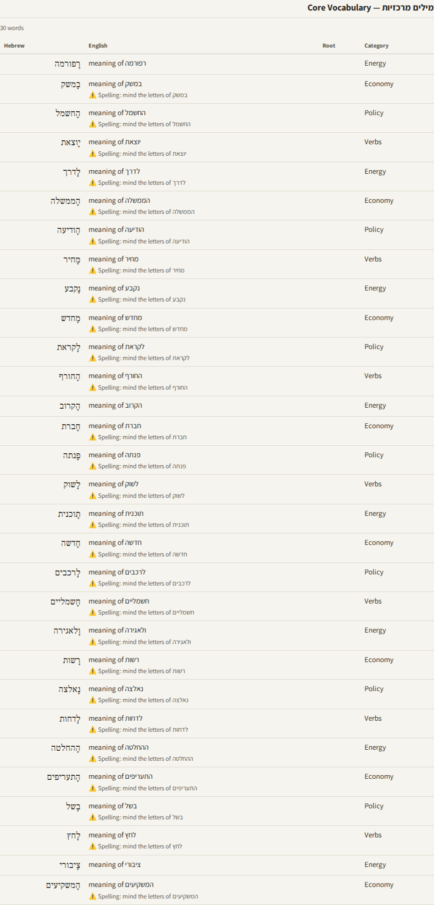
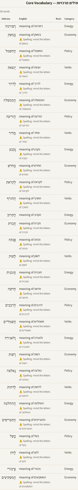
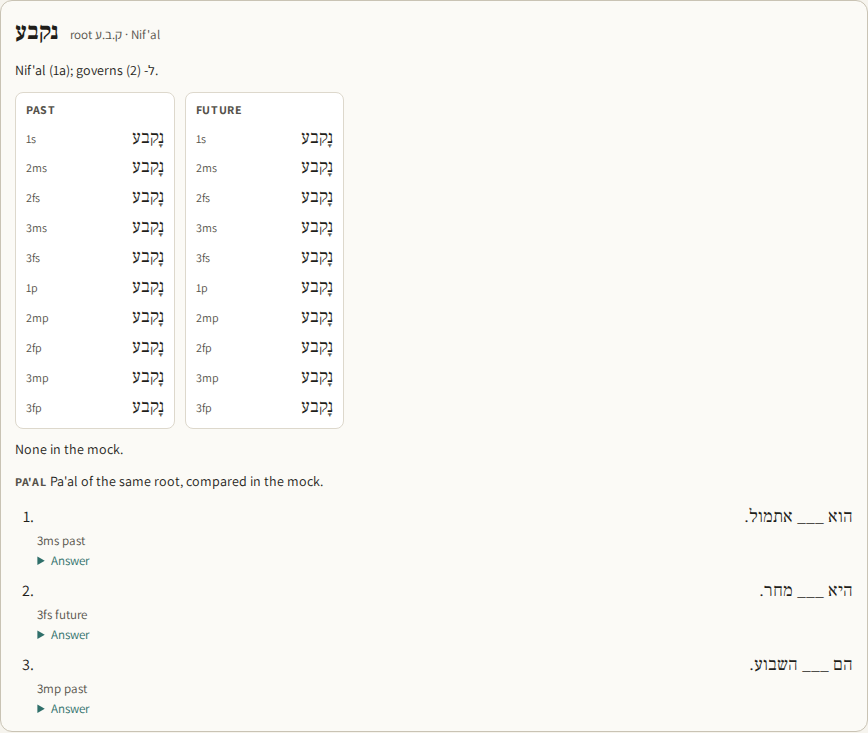
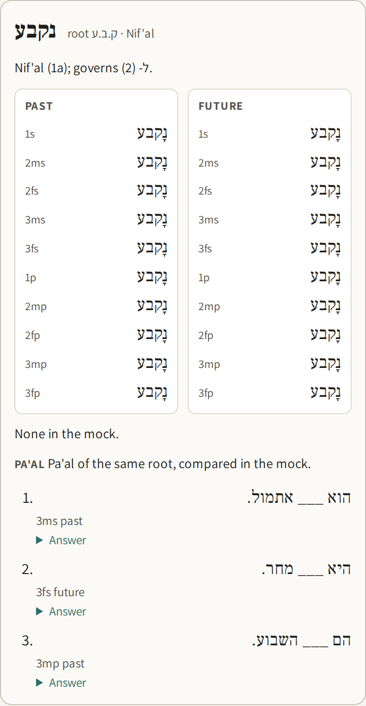

# FIELD REPORT — hebrew-hunt-two — 3 Oct 2026

Dan sees one change on screen: in a study guide's vocabulary, the ⚠️ sits only where there is a trap, and every drill's future table is complete. The chooser's change shows only in which article the next tap of **Find an article** brings. Nothing to react to.

Session hebrew-hunt-two on card `hebrew-hunt`. It ran on the rented Linux machine (`agent-machine-dan`) with the kit's checks and rules in force. Brief: the note "START HERE — hebrew-hunt-two — 3 Oct 2026".

- Pull request: https://github.com/isleofdan/hebrew-reader/pull/10 (branch `hunt-two`)
- Checks on the branch: green, https://github.com/isleofdan/hebrew-reader/actions/runs/37110045978 ("check: all passed: syntax, tests, screenshots")

## What stands

1. **The chooser skips live blogs and market tickers** (`lib/hunt.js`, `pageKind`). This is a recorded rule, run before the model is asked. A candidate is skipped when any of these holds, checked in this order:
   - The page calls itself a live blog. Globes puts `<meta property="article:type" content="סקירת מסחר">` ("trading review") on its market live blogs; other Globes types seen were חדשות, ראיון and ניתוח ופיצ'ר. The other two markers are schema.org `LiveBlogPosting`, and "עדכונים שוטפים" ("running updates") in the title. → `skipped: live blog (the page calls itself "סקירת מסחר")`
   - 4 or more lines open with a clock time (HH:MM). → `skipped: live blog (N lines open with a clock time)`
   - 13% or more of the words are numbers or market names (מדד, ת"א, נאסד"ק, דאו, S&P, אג"ח, שקל, דולר, מניות …). → `skipped: market ticker (N% numbers and market names)`
   - Over 1,500 Hebrew words. With the existing 600 floor, this makes a window of 600–1,500. → `skipped: N words, over 1500`

   The reasons are written where the hunt-build report says choices are recorded: each tap's `hunts` row, shown on the Articles screen under "Last search". Among the pieces that pass, nothing changed: the same three tests and the same model question.
2. **The trial** (`POST /articles/find?trial=1`, the deploy's step) now runs a tap's tests on today's candidates. It puts candidates to the model (at most 6) until one would be chosen, and answers `tried`: every candidate with its reason. Nothing is stored. The deploy step prints that list, and its time limit is now 480 s.
3. **The study guide's vocabulary** shows ⚠️ only on a Spelling, Confusable or Prep note. "No spelling trap" is not shown in any form the model writes it: alone, as "⚠️ Spelling: no spelling trap", or after a Prep note. Construction and Idiom notes still show, without the icon. **Guides stored earlier** (Dan's 3 Oct guide included) are redrawn the same way when served; the stored record is unchanged.
4. **Future tables are complete.** The guide model is asked for all ten persons in the past and the future. A drill whose future lacks a person its past has fails a check, and the guide is asked for once more, like any failed check.
5. **Checks:**
   - `hunt-smoke.mjs` went from 31 to 39 checks: the live-blog marker, clock lines, ticker, length window, the trial's list, the flag rule, a stored guide redrawn, and a future-table rebuild.
   - `hunt-pages.mjs` adds two checks at each width, plus close-up shots `hunt-vocab-*` and `hunt-drill-*`.

## UI review (per screen you touched)

**Screen: Study guide** (`/guide/<id>`), the vocabulary table and the conjugation drills. This session changed only these two parts.

1. Speed of the frequent action: here that is reading, and it is faster now: trap rows are the only ones with an icon, so they can be scanned for.
2. Recovery from a mistake: not applicable. Nothing on these parts takes an action.
3. Finding the tool: not applicable, no new control. Where the flag sits did not change (under the English, in the same cell).
4. Orientation: improved. ⚠️ now means "trap here" and nothing else; before, it also sat on rows that said there was none.
5. Feedback: not applicable, no action.
6. Interruption: not applicable. The page is static, with no box and no refresh.
7. Thumb reach: not applicable, no new control. The phone shot shows the table fits the width; the drill's tables sit side by side on the computer and stack on the phone.
8. Defaults and prefill: not applicable, no input.

- **Not added, and why:** no legend for the ⚠️, since its meaning is now single. No colour coding per flag kind, since the marker words (Prep, Spelling, Confusable) already name it. The same exact-match rule in Guy's lesson guides (`public/guide-ui.js`, line 121) was left as it is, out of scope.
- **Which of the eight Dan's requests came from:** both from 4, orientation. The icon was on rows with no trap, and a future table with persons missing read as complete.

Screenshots (from the Checks run on the branch, stand-in model, so the English is placeholder text):

| | Computer | Phone |
| - | - | - |
| Vocabulary: ⚠️ only on trap rows; rows with none (רפורמה, הקרוב, ציבורי) show nothing |  |  |
| Drill: past and future, ten persons each |  |  |

In the stand-in's guide nearly every word holds a spelling letter, so no row shows a Prep note alone. That case (`⚠️ Prep: ל- (English: to); no spelling trap` shown as `⚠️ Prep: ל- (English: to)`) is proven by `hunt-smoke.mjs`.

**Screen: Articles, "Last search"**: changed only in its wording. The new reasons ("skipped: live blog …") appear in the existing list. No new control, so all eight are not applicable.

## What the brief got wrong

1. **"The reader's own conjugation source."** The reader has no conjugator and no paradigm tables in code. Its only conjugation reference is Dan's own June guide, `docs/guy-lessons/chat-guide-2026-06-15.md`. In that guide, both the past and future columns run אני, אתה, את, הוא, היא, אנחנו, אתם/ן, הם/ן. The check takes its person list (`PERSONS` in `lib/hunt.js`) from there. The forms themselves are still the guide model's, and no code checks them.
2. **"A length window so a typical reported piece passes and a live blog does not."** The window holds against every live blog measured, but it has a cost. Three long reported pieces of the 16 that have 600 words or more are also skipped (1,954, 2,747 and 2,847 words), so the window narrows the choice. The note's own section 2d gives 600–1,500 and says a very long feature "is cut to its key passages". If Dan wants long features back, the live-blog and ticker tests alone catch every live page measured (ask 2).
3. **Step 4's live blog** is no longer the newest item in the Globes feed under its old title. The same address (`did=1001558228`) has been re-headed in the feed ("שוק העבודה האמריקאי מתקרר…"); the page still reads "נעילה חיובית בארה"ב…". It was identified by its address.

## Deliberate divergences

1. The "already in your articles" check now runs after the page tests, not before the fetch. A live blog Dan already has therefore shows as "skipped: live blog", not "already in your articles". The cost is one page load for each stored article met again.
2. The trial walks the same candidates as a tap and may put up to 6 to the model, as a tap does, not just one. That is what lets it show the chosen piece and every rejection reason.
3. Stored guides are fixed when served, not rewritten, so Dan's records stay untouched.

## Verify

1. **Environment.**
   1. `agent-machine-dan`.
   2. `isleofdan`, with scopes gist, read:org, repo, workflow.
   3. Clone clean; `origin/main` at `cc8e24c` (the merge of PR #9). Branch `hunt-two` was made from it.
   4. Baseline `check: all passed: syntax, tests; skipped screenshots (no browser on this machine; the Checks workflow runs them)`.
   5. `get_thread hebrew-hunt` read, including the 2026 Hebrew Study note (3 Oct). The OpenRouter key still does not load on this machine (`key-missing`).
2. **The measurement**, 3 Oct 2026, through the reader's own `fromUrl`. The first 12 Globes links from all three feeds, newest first, plus the first 12 links of Calcalist's `/local_news` and of Maariv's economy feed. Columns: page type (Globes' `article:type`), lines opening with a clock time, % numbers and market names, Hebrew words, verdict.

   | Site | Address | Title | Type | Clock | Market | Words | Verdict |
   | - | - | - | - | - | - | - | - |
| Globes | globes.co.il/news/article.aspx?did=1001558228 | נעילה חיובית בארה"ב אחרי פרסום נתוני התעסוקה; | סקירת מסחר | 10 | 17.2% | 1,582 | skipped: live blog (the page calls itself "סקירת מסחר") |
| Globes | globes.co.il/news/article.aspx?did=1001558056 | התשואה שלה נמחקה בגלל מניה אחת, החלום לפרוש ב | ראיון | 0 | 5.4% | 1,274 | passes (to the three tests) |
| Globes | globes.co.il/news/article.aspx?did=1001557931 | הוא מבכירי העיתונאים הפיננסים בעולם ויש לו עצ | ראיון | 0 | 3.4% | 2,847 | skipped: 2847 words, over 1500 |
| Globes | globes.co.il/news/article.aspx?did=1001557969 | איפה עובד צביקה מנס מגיבורי טיסת פליי דובאי? | ניתוח ופיצ'ר | 0 | 0% | 35 | dropped: 35 words, under 600 |
| Globes | globes.co.il/news/article.aspx?did=1001558097 | וול סטריט ננעלה בעליות קלות; תשואות האג"ח נסו | סקירת מסחר | 12 | 14.5% | 2,663 | skipped: live blog (the page calls itself "סקירת מסחר") |
| Globes | globes.co.il/news/article.aspx?did=1001558102 | פרטים חדשים מהחקירה: הטייס העומאני התכוון לבצ | חדשות | 56 | 3.2% | 2,533 | skipped: live blog (56 lines open with a clock time) |
| Globes | globes.co.il/news/article.aspx?did=1001558283 | בכיר בחברה ממשלתית נחקר במשטרה בחשד לזיוף והפ | חדשות | 0 | 2.1% | 136 | dropped: 136 words, under 600 |
| Globes | globes.co.il/news/article.aspx?did=1001558275 | שני הפרופסורים הישראלים למתמטיקה שזכו בפרס הי | חדשות | 0 | 2.1% | 319 | dropped: 319 words, under 600 |
| Globes | globes.co.il/news/article.aspx?did=1001558223 | מכר את כל המניות שלו בסמארט שוטר ב-51 מיליון  | ניתוח ופיצ'ר | 0 | 8.8% | 592 | dropped: 592 words, under 600 |
| Globes | globes.co.il/news/article.aspx?did=1001558202 | אין תחרות ואלטרנטיבה: כשמבוטחים שבויים בידי מ | ניתוח ופיצ'ר | 0 | 1.2% | 702 | passes (to the three tests) |
| Globes | globes.co.il/news/article.aspx?did=1001558175 | המועמדת החדשה והמפתיעה למדד ת"א 35 | ניתוח ופיצ'ר | 0 | 11% | 799 | passes (to the three tests) |
| Globes | globes.co.il/news/article.aspx?did=1001558144 | אחרי ניסיון המיזוג הכושל: אפקון רוצה להנפיק א | ניתוח ופיצ'ר | 0 | 5.8% | 367 | dropped: 367 words, under 600 |
| Calcalist | calcalist.co.il/local_news/article/hkec9oq9ml | "אם התקציב הוא רק המלצה, יש לנו עוד המון לאן  | — | 0 | 2.2% | 2,747 | skipped: 2747 words, over 1500 |
| Calcalist | calcalist.co.il/local_news/article/bytg1zrqzg | נחשפה זהות הטייס-המחבל: "רצה לרסק את המטוס בי | — | 0 | 1.6% | 899 | passes (to the three tests) |
| Calcalist | calcalist.co.il/local_news/article/hk1wxtaqge | טיסה ראשונה להשבת ישראלים מדובאי נחתה בנתב"ג  | — | 0 | 0.5% | 584 | dropped: 584 words, under 600 |
| Calcalist | calcalist.co.il/local_news/article/hyux059cmg | מחקר: עיסוק ההורים מנבא הישגי הילדים כפול מהה | — | 0 | 5.7% | 331 | dropped: 331 words, under 600 |
| Calcalist | calcalist.co.il/local_news/article/syxf9899ge | "קפצנו שלושה על הטייס. נטרלנו אותו. אני מלא ד | — | 0 | 0.7% | 289 | dropped: 289 words, under 600 |
| Calcalist | calcalist.co.il/local_news/article/bkn6cgf9fe | בחזרה לשולח: למה לסינים אין ריקול? | — | 0 | 2.9% | 101 | dropped: 101 words, under 600 |
| Calcalist | calcalist.co.il/local_news/article/h1obsircge | משרד התחבורה דורש לקבל לידיו את התחנות המרכזי | — | 0 | 3.2% | 1,158 | passes (to the three tests) |
| Calcalist | calcalist.co.il/local_news/article/r1vs00s8qmg | רוצים פריסה ל-40 שנה? השחקניות החדשות שמסתערו | — | 0 | 4.4% | 1,017 | passes (to the three tests) |
| Calcalist | calcalist.co.il/local_news/article/r16f0y2qzg | מעמד המורה בקרשים? לא בהשוואה בינלאומית | — | 0 | 7.8% | 661 | passes (to the three tests) |
| Calcalist | calcalist.co.il/local_news/article/s16ky11hqge | בכיר בחברה ממשלתית נחקר בחשד למרמה, הפרת אמונ | — | 0 | 3.2% | 121 | dropped: 121 words, under 600 |
| Calcalist | calcalist.co.il/local_news/article/hyu1mk9qgg | העליון דחה דיון נוסף בחוק מיסוי רווחים כלואים | — | 0 | 1.9% | 413 | dropped: 413 words, under 600 |
| Calcalist | calcalist.co.il/local_news/article/b1ito85qze | הרשות הפלסטינית: "ישראל לא מסייעת במאבק בגניב | — | 0 | 1.9% | 633 | passes (to the three tests) |
| Maariv | maariv.co.il/economy/israel/article-1373034 | "כמו הסנקציות על איראן ורוסיה": התוכנית לחנק  | — | 1 | 0.9% | 835 | passes (to the three tests) |
| Maariv | maariv.co.il/economy/israel/article-1373007 | הקניון הגוסס של ישראל: "אין שם כלום. 30 שנה ל | — | 1 | 1.1% | 515 | dropped: 515 words, under 600 |
| Maariv | maariv.co.il/economy/israel/article-1372702 | זול, בטוח וכמעט בלי אנטישמיות: היעד שהישראלים | — | 1 | 2.3% | 1,954 | skipped: 1954 words, over 1500 |
| Maariv | maariv.co.il/economy/israel/article-1372669 | אירוע אחד בשמיים - והמשקיעים הסתערו על החברות | — | 1 | 3.4% | 757 | passes (to the three tests) |
| Maariv | maariv.co.il/economy/israel/article-1372657 | טראמפ לא לבד: רווח מהיר במזומן – ולעזאזל העתי | — | 1 | 3.5% | 682 | passes (to the three tests) |
| Maariv | maariv.co.il/economy/israel/article-1372641 | ישראל במקום הרביעי בעולם בנתון כלכלי שלא הרבה | — | 1 | 8% | 1,442 | passes (to the three tests) |
| Maariv | maariv.co.il/economy/israel/article-1372577 | פי 7 מ"טבע": החברה הראשונה בבורסת תל אביב ששו | — | 1 | 13.2% | 238 | skipped: market ticker (13.2% numbers and market names) |
| Maariv | maariv.co.il/economy/israel/article-1372563 | היועמ"שית אישרה: מחיר הדלק צפוי לרדת ל-7.77 ש | — | 1 | 4.9% | 312 | dropped: 312 words, under 600 |
| Maariv | maariv.co.il/economy/israel/article-1372522 | "זה לא חרם, זה מס ציות": הסנאט בונה שורת סנקצ | — | 1 | 2.8% | 687 | passes (to the three tests) |
| Maariv | maariv.co.il/news/israel/article-1372501 | בחיפה זועמים: מנהרות הכרמל הגיעו הבוקר לשיא ש | — | 1 | 7.4% | 233 | dropped: 233 words, under 600 |
| Maariv | maariv.co.il/economy/israel/article-1372385 | נשיא יועצי המס באמירה חריגה: לגייס את השב"כ ל | — | 1 | 1.6% | 348 | dropped: 348 words, under 600 |
| Maariv | maariv.co.il/economy/israel/article-1372382 | אלו היעדים החמים של גנבי הרכב: הערים שמככבות  | — | 1 | 5.1% | 200 | dropped: 200 words, under 600 |

   What the numbers show:
   - **Clock lines.** Live pages had 10, 12, 10 and 56; no other page had more than 1 (every Maariv page has one time line at the top). Threshold: 4.
   - **Market share.** Market blogs ran 14.5–17.2%. Reported pieces of 600 words or more were at most 11.0%. Threshold: 13%. The one page above it besides the blogs was Maariv's 238-word Teva brief, already under the 600 floor.
   - **Length.** Live blogs ran 1,582–2,663 words. Reported pieces of 600 words or more had a median of 867. Window: 600–1,500.
   - **Markers.** Globes' `article:type` "סקירת מסחר" caught all three market blogs. The rolling N12 news page on Globes (did=1001558102) has no such type; it was caught by its 56 clock lines. No Calcalist or Maariv page measured carried a live marker, and none was a live page, so their markup for a live page is UNKNOWN. `LiveBlogPosting` is in the rule as the standard marker, not one seen here.
3. **The trial on today's candidates** (`?trial=1`, local server, live sites, the stand-in for the model because this machine has no key; 10.6 s):
   - Globes, "נעילה חיובית בארה"ב אחרי פרסום נתוני התעסוקה; תשואות האג"ח ירדו" (did=1001558228, the live blog Dan got on 3 Oct), 1,582 words: **skipped: live blog (the page calls itself "סקירת מסחר")**
   - Calcalist, "אם התקציב הוא רק המלצה, יש לנו עוד המון לאן להידרדר", 2,747 words: skipped: 2747 words, over 1500
   - Maariv, ""כמו הסנקציות על איראן ורוסיה": התוכנית לחנק המשק הישראלי יצאה לדרך", 835 words: **would be chosen**

   A full local tap on a scratch database recorded the same three outcomes in its "Last search" record ("chosen" for the Maariv piece) and made its guide. Whether the real model passes the Maariv piece on the three tests shows in the deploy step's list after the merge.
4. `check: all passed: syntax, tests; skipped screenshots (no browser on this machine; the Checks workflow runs them)` after the changes. `hunt-smoke.mjs`: 39 passed.
5. Screenshots: above, from the Checks run's `hunt-screenshots` artifact. Both widths passed the page checks: "vocabulary: the ⚠️ only on a spelling trap or a preposition note, "no spelling trap" nowhere" and "the drill's future table carries every person the past does, 2fs, 2mp and 2fp included".
6. Checks: https://github.com/isleofdan/hebrew-reader/actions/runs/37110045978 (pull request) and 37110035516 (push), both green. Deploy run and live site: after the merge (below).

## Asks

1. **Merge PR #10? yes/no.** Checks are green. **Recommended: yes.** The merge deploys, and the deploy's trial prints today's candidates with the real model's verdict.
2. **Keep the 1,500-word ceiling?** It drops long reported features along with live blogs. The live-blog and ticker tests alone caught every live page measured. **Recommended: yes, keep it** (it is the note's own range); revisit if Dan misses long features.

(The step 1 commit message says "38 real candidates"; the count measured is 36, the table above.)
